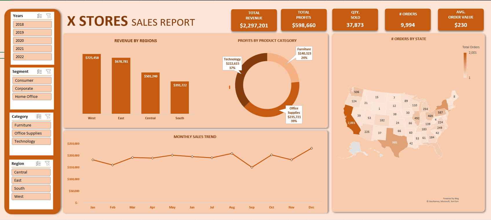
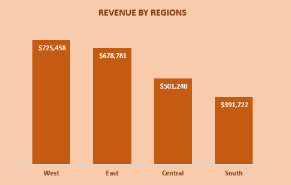

# XYZ Stores Analysis
## by Kola Ademola
___

___
## INTRODUCTION
___
This is just a documentation demo.
___
## PROBLEM STATEMENT
___
For this project I wanted to find out the following:
* Which Region generated the most revenue?
* What is the most profitable product?
___
## DATA SOURCE
___
This dataset was gotten from this website. [Link to Dataset](www.google.com)
___
## SKILLS DEMONSTRATED
___
I used Microsoft for this Project.

I built advanced pivot table to answer some
___
## ANALYSIS & VISUALIZATION
___
* Which Region generated the most revenue?

